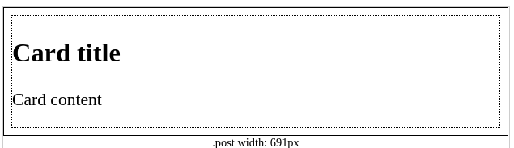
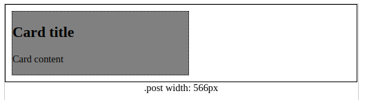

## [@container](https://developer.mozilla.org/en-US/docs/Web/CSS/@container)

> The @container CSS at-rule is a conditional group rule that applies styles to a containment context. Style declarations are filtered by a condition and applied to the container if the condition is true. The condition is evaluated when the container changes size.

[State Container Queries](https://ishadeed.com/article/css-state-queries/)

### Logical keywords in container queries
> ogical keywords can be used to define the container condition:

* `and` combines two or more conditions.
* `or` combines two or more conditions.
* `not` negates the condition. Only one 'not' condition is allowed per container query and cannot be used with the and or or keywords.


### Code example

```
span {
  display: block;
  text-align: center;
}
.card {
  margin: 10px;
  border: 2px dotted;
  font-size: 1.5em;
}
.post {
  border: 2px solid;
}

/* A container context based on inline size */
.post {
  container-type: inline-size;
}

/* Apply styles if the container is narrower than 650px */
@container (width < 650px) {
  .card {
    width: 50%;
    background-color: gray;
    font-size: 1em;
  }
}


<div class="post">
  <div class="card">
    <h2>Card title</h2>
    <p>Card content</p>
  </div>
</div>

```
## Result of implementation 

| Not apply container query         | Apply container query     |
|--------------|-----------|
|  |       |


### Constituent properties

* `container: aspect-ratio;`
* `container: block-size;`
* `container: height;`
* `container: inline-size;`
* `container: orientation;`
* `container: width;`