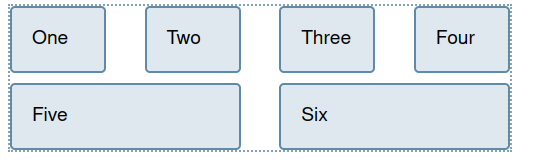

## [flex + gap](https://developer.mozilla.org/en-US/docs/Web/CSS/CSS_Flexible_Box_Layout/Aligning_Items_in_a_Flex_Container#creating_gaps_between_items)

> To create a gap between flex items, use the [gap](https://developer.mozilla.org/en-US/docs/Web/CSS/gap), [column-gap](https://developer.mozilla.org/en-US/docs/Web/CSS/column-gap), and [row-gap](https://developer.mozilla.org/en-US/docs/Web/CSS/row-gap) properties. The column-gap property creates gaps between items on the main axis. The row-gap property creates gaps between flex lines, when you have `flex-wrap: wrap;`. The [gap](https://developer.mozilla.org/en-US/docs/Web/CSS/gap) property is a shorthand that sets both together.

### Code example

```
<style>
.box {
    display: flex;
    flex-wrap: wrap;
    row-gap: 10px;
    column-gap: 2em;
}

.box > * {
    flex: 1;
}
</style>

<div class="box">
  <div>One</div>
  <div>Two</div>
  <div>Three</div>
  <div>Four</div>
  <div>Five</div>
  <div>Six</div>
</div>
      
```
## Result of implementation 
